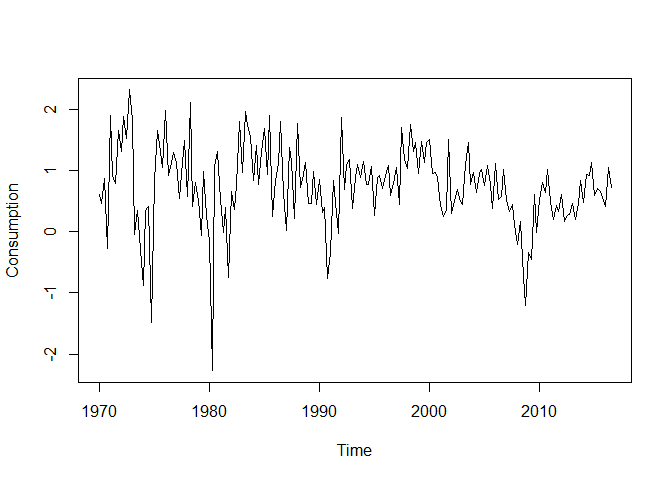

autocovarianceTesting: Test for Equality of Autocovariance Functions in
Time Series
================
Daniel Cirkovic

The package ‘autocovarianceTesting’ implements multiple hypothesis tests
for testing equality of autocovariance functions for two mean zero,
stationary time series. The time series are allowed to be multivariate
and linearly dependent. We implement methods assuming independence of
the series from [“Testing equality of stationary autocovariances.” Lund
et. al (2009)](https://doi.org/10.1111/j.1467-9892.2009.00616.x) and new
extensions to linearly dependent times series. We also implement a
weighting mechanism to the former tests by borrowing ideas from [“New
Weighted Portmanteau Statistics for Time Series Goodness of Fit Testing”
Fisher and Gallagher
(2012)](https://doi.org/10.1080/01621459.2012.688465). The package also
implements bootstrap methods from [“A computational bootstrap procedure
to compare two dependent time series” Jin et. al
(2019)](https://doi.org/10.1080/00949655.2019.1639704), offering
extensions to multivariate series.

‘autocovarianceTesting’ includes one function: `autocovarianceTest`.
`autocovarianceTest` allows the the user to supply two time series and
select from any combination of the previously mentioned methods to test
for equality of autocovariance functions. Choices of methods are made
through the `test` argument. See function documentation for more
details.

## Installation

The package is currently available on github. To install, use the
following:

``` r
# Installation of autocovarianceTesting
devtools::install_github("cirkovd/autocovarianceTesting", build_vignettes = TRUE)
```

## Example

For quarterly change in US consumption and income from 1970 to 2016,
test if the autocovariance structure of the series differ up to lag 12.

``` r
library(autocovarianceTesting)
library(fpp2) # not needed for package, just used for data
head(uschange)
```

    ##         Consumption     Income Production   Savings Unemployment
    ## 1970 Q1   0.6159862  0.9722610 -2.4527003 4.8103115          0.9
    ## 1970 Q2   0.4603757  1.1690847 -0.5515251 7.2879923          0.5
    ## 1970 Q3   0.8767914  1.5532705 -0.3587079 7.2890131          0.5
    ## 1970 Q4  -0.2742451 -0.2552724 -2.1854549 0.9852296          0.7
    ## 1971 Q1   1.8973708  1.9871536  1.9097341 3.6577706         -0.1
    ## 1971 Q2   0.9119929  1.4473342  0.9015358 6.0513418         -0.1

``` r
# Structure data
t <- time(uschange)
# US consumption
usconsumption <- matrix(uschange[ ,1])
# US income
usincome <- matrix(uschange[ ,2])

# Plot the two datasets, no obvious skewness, minor outliers
plot(t, usconsumption, type = "l", xlab = "Time", ylab = "Consumption")
```

<!-- -->

``` r
plot(t, usincome, type = "l", xlab = "Time", ylab = "Income")
```

<!-- -->

``` r
# The series exhibit clear dependence
ccf(c(usconsumption), c(usincome), main = "Cross-Correlation Function")
```

<!-- -->

Since the series exhibit clear correlation, only use the dependent tests
provided in `autocovarianceTest`.

``` r
# Make the series mean zero
usconsumption <- usconsumption - mean(usconsumption)
usincome <- usincome - mean(usincome)

set.seed(4321)
# Run test for up to lag 12
output <- autocovarianceTest(usconsumption, usincome, L = 12, 
                   test = c("Dependent", "bootBartlett", "bootDependent"),
                   B = 1000, prewhiten = TRUE, plot = TRUE)
```

    ## Warning in compatibilityChecks(X, Y, L, test, trunc, B, b, prewhiten, plot): b
    ## is small (b < 3), bootstrap resamples may not be representative

<!-- -->

``` r
output
```

    ## 
    ##  Fixed Lag Tests:
    ##  
    ##       Test Chi-Sq df p-value
    ##  Dependent 59.006 13       0
    ## 
    ##  Weighted Fixed Lag Tests:
    ##  
    ##                Test  Gamma alpha  beta p-value
    ##  Weighted Dependent 50.911 3.517 1.392       0
    ## 
    ##  Automatic Lag Selection Tests:
    ##  
    ##                Test Statitic L hat p-value
    ##       Bootstrap-Jin   10.669     6   0.007
    ##  Bootstrap-Bartlett   38.247     6   0.006

All tests reject the null hypothesis of equality of autocovariances up
to lag 12.

For more on assumption checking and general function use, please see the
vignette.
